# dLLM — Rethinking Generation Beyond Autoregressive Models
## ICLR Blogpost 2026 | ICML 2026 Presentation
 

### Suhas Pai & Xiaojun Ren
### Fruitless Labs

---

# What is a diffusion Large Language Model?

> TLDR: Diffusion Large Language Models (dLLMs) provide an alternative to autoregressive Transformers, supporting parallel token generation and flexible infilling. They excel in structured, long-horizon, or data-constrained settings.

*Parallel token generation · Flexible infilling · Data efficiency*

    

<Footnotes separator>
  <Footnote :number="1">Nie et al. (2025) — Large Language Diffusion Models (LLaDA)</Footnote>
</Footnotes>

---

# The Problem with Autoregressive Models

Most language models follow a time-tested recipe: a **Transformer backbone** trained with a **next-token prediction** objective, generating left to right. 

ARMs factorize the joint probability of a sequence of length *T* as a product of next-step conditionals:

$$p(x_{1:T}) = \prod_{t=1}^{T} p(x_t \mid x_{<t})$$

Where:
- $p(x_{1:T})$ — joint probability of the entire sequence
- $p(x_t \mid x_{<t})$ — probability of the next token given all previous tokens
- $x_{<t} = (x_1, x_2, \ldots, x_{t-1})$ — the prefix up to time step $t-1$

<Footnotes separator>
  <Footnote :number="1">Sutton (2019) — The Bitter Lesson</Footnote>
</Footnotes>
---

# Structural Limitations of ARMs

1. **Sequential bottleneck** — latency scales with output length
2. **Error snowball** — one wrong token poisons all subsequent context
3. **No revision** — committed tokens can never be edited in-place
4. **Token-level objective** — optimizes per-token likelihood, not sequence-level goals; poor long-horizon planning
5. **Hallucination amplification** — wrong tokens become future context, producing coherent but factually wrong narratives
6. **Representation cost** — some distributions require super-polynomial AR size vs. latent-variable models

---

# Masked Diffusion: The Core Idea
Instead of generating left-to-right, masked diffusion works in two phases:

  

    
  

  

    
<strong>Forward process</strong> — gradually replace tokens with <code>[MASK]</code>:

    <ul>
      <li>At $t = 0.2$: <code>He invented the [MASK] as a means to [MASK] vengeance upon [MASK] detractors</code></li>
      <li>At $t = 0.8$: <code>[MASK] invented [MASK] [MASK] [MASK] means [MASK] exact vengeance [MASK] [MASK]</code></li>
    </ul>
  

<Footnotes separator>
  <Footnote :number="1">Nie et al. (2025) — Large Language Diffusion Models (LLaDA)</Footnote>
</Footnotes>

---

# Masked Diffusion: The Core Idea
Instead of generating left-to-right, masked diffusion works in two phases:

  

    
  

  

    
<strong>Reverse process</strong> — iteratively predict and "lock in" tokens until fully unmasked:

    <table>
      <thead>
        <tr>
          <th>Step</th>
          <th>Output</th>
        </tr>
      </thead>
      <tbody>
        <tr>
          <td>Step 0</td>
          <td><code>[MASK] [MASK] [MASK] [MASK] [MASK]</code></td>
        </tr>
        <tr>
          <td>Step K/2</td>
          <td><code>Yes, [MASK] is an island [MASK] Yemen.</code></td>
        </tr>
        <tr>
          <td>Step K</td>
          <td><code>Yes, Socotra is an island in Yemen.</code> ✓</td>
        </tr>
      </tbody>
    </table>
  

---

# Masked Diffusion vs BERT

Learning objective looks similar to masked language modeling (BERT) or denoising autoencoding (BART)

  

    
  

  

    
<strong>Key Distinction</strong>

    
Unlike BERT/BART, the masking rate <em>t</em> varies continuously per example

    
The model learns to denoise at <em>every</em> noise level, not just a fixed corruption rate

  

---

# Forward Process

  

    
    
  

  
p]:mb-1">
    
The model predicts masked tokens in <em>x_t</em>, minimising a weighted cross-entropy over masked positions.

    
The weighting term <em>w(t)</em> prevents heavily-masked examples from dominating the training signal; one common choice is <em>w(t) = 1/t</em>.

    
In BERT the masking rate is fixed; in masked diffusion <em>t</em> varies per example — the model learns to denoise at every noise level.

  

$$\mathcal{L}(\theta) = \mathbb{E}_{x_0, t, x_t} \!\left[ w(t) \sum_{i \in \mathcal{M}(x_t)} -\log p_\theta(x_{0,i} \mid x_t, t) \right]$$

---

# Reverse Process

  

    
    
p]:mb-1">
      
<strong>Note:</strong> At inference the full output starts masked and is gradually unmasked, which is a discrepancy from training where only a fraction of tokens are masked.

    

  

  
p]:mb-1">
    
For a given prompt, the output is initialised as <code>L</code> number of <code>[MASK]</code> tokens, where <code>L</code> is a hyperparameter.

    
The reverse process runs for <code>K</code> denoising steps. At each step the model predicts all <code>[MASK]</code> positions <strong>in parallel</strong>, then:

    <ul>
      <li><strong>Commits</strong> high-confidence tokens by unmasking</li>
      <li><strong>Remasks</strong> low-confidence tokens for further refinement</li>
    </ul>
    
Generation stops after <code>K</code> steps; tokens after the first <code>&lt;EOS&gt;</code> are discarded.

  

---

# How to Train Your Own dLLM

  
<strong>Training pipeline:</strong> Pre-training → Midtraining/Annealing → Instruction Tuning → RL

  

    
  

  <i> dLLMs can be trained from scratch <em>or</em> adapted from an existing ARM via continued pre-training with a bidirectional attention mask.</i>

<Footnotes separator>
  <Footnote :number="1">Chandrasegaran et al. (2025) — RND1: Simple, Scalable AR-to-Diffusion Conversion</Footnote>
</Footnotes>

---

# Advantages Over ARMs

| | |
|-----------|-------------|
| **Any-order generation** | tokens predicted in any order, not locked to left-to-right |
| **In-place revision** | tokens can be remasked and regenerated at any point |
| **Parallel token prediction** | all masked positions predicted simultaneously |
| **Structured infilling** | provide a JSON/code template; dLLM fills the blanks, guaranteeing format adherence |

  

---

# Decoding Strategies

<i>how to decide which tokens to commit at each step</i>

| Strategy | Mechanism |
|----------|-----------|
| **Confidence-Based** | Lock in highest-probability tokens first |
| **Entropy-Based** | Commit lowest-entropy positions — more robust |
| **Margin-Based** | Commit when gap between top-1 and top-2 is large |
| **PC Sampler** | Position-calibrated to suppress left-side bias |
| **EB Sampler** | Entropy-bounded: commit until entropy budget is spent |

<Footnotes separator>
  <Footnote :number="1">Gao et al. (2025) — Self Speculative Decoding for Diffusion LLMs</Footnote>
  <Footnote :number="2">Wang et al. (2025) — Remasking Discrete Diffusion Models with Inference-Time Scaling</Footnote>
  <Footnote :number="3">Zhang et al. (2025) — Syntax-Guided Diffusion Language Models with User-Integrated Personalization</Footnote>
</Footnotes>

---

# Pitfall 1: Fixed Output Length
**Problem:** Unlike ARMs, dLLMs must pre-allocate output length before generation
- Too short → truncation or skipped reasoning steps
- Too long → neural degeneration + expensive quadratic attention

---

# Pitfall 1: Fixed Output Length

**Solution — DAEDAL** *(Dynamic Adaptive Length Expansion)*
1. Start with short length (64–128 tokens); run one denoising step
2. Average `<EOS>` probability at tail — if below threshold $T$, extend
3. During denoising, insert `[MASK]` tokens at lowest-confidence positions to allow local expansion

  

<Footnotes separator>
  <Footnote :number="1">Li et al. (2025) — Beyond Fixed: Training-Free Variable-Length Denoising for Diffusion LLMs</Footnote>
</Footnotes>

---

# Pitfall 2: Fixed Denoising Budget
**Problem:** Too few steps → incomplete answer. Too many → **temporal oscillation** (model overshoots and drifts away from a correct intermediate answer).

---

# Pitfall 2: Fixed Denoising Budget

**Solution — Temporal Semantic Entropy (TSE) + Self-Consistency Voting**
- TSE measures entropy over semantic clusters of intermediate answers; high TSE flags uncertain queries
- **Temporal Self-Consistency Voting** selects the final answer by majority vote across all denoising steps, with exponential weighting toward later steps

<Footnotes separator>
  <Footnote :number="1">Wang et al. (2025) — Time Is a Feature: Exploiting Temporal Dynamics in Diffusion LLMs</Footnote>
  <Footnote :number="2">Huang et al. (2025) — Don't Settle Too Early: Self-Reflective Remasking for Diffusion LLMs</Footnote>
</Footnotes>

---

# Pitfall 3: Fixed Block Size

**Problem:** For long outputs, tokens are divided into sequential blocks. Fixed block size causes:
- **Late decoding overhead** — high-confidence tokens outside the current block wait unnecessarily
- **Premature decoding error** — low-confidence tokens get locked in before sufficient context is available

---

# Pitfall 3: Fixed Block Size

**Solution — AdaBlock**

  

The confidence landscape has three regions: *high-confidence plateau*, *volatility band* (where active decoding happens), and *low-confidence floor*. AdaBlock draws block boundaries at **semantic delimiters** (newlines, periods) identified by their confidence exceeding a threshold $T$ — making each block a self-contained semantic unit.

<Footnotes separator>
  <Footnote :number="1">Lu et al. (2025) — AdaBlock-dLLM: Semantic-Aware Diffusion LLM Inference via Adaptive Block Size</Footnote>
</Footnotes>

---

# Pitfall 4: Static Confidence Threshold
**Problem:** Mean confidence follows an **inverted-U shape** across denoising steps — low early, peaks mid-way, low again at the end.

  

---

# Pitfall 4: Static Confidence Threshold
**Solution — Dynamic $\tau$:** Use the task's confidence trajectory as its signature.

Set threshold adaptively per task type (e.g. GSM8K vs. GPQA datasets have distinct signatures).

<Footnotes separator>
  <Footnote :number="1">Shen & Ro (2025) — Beyond Static Cutoffs: One-Shot Dynamic Thresholding for Diffusion LLMs</Footnote>
</Footnotes>

---

# Pitfall 5: Information Not Carried Across Denoising Steps

**Problem:** At step $p$: model sees `Michael [MASK] to New York` and predicts probabilities `went: 0.4`, `moved: 0.3` — but threshold not met, so token stays masked. 

At step $p+1$, those probabilities are **discarded entirely** and recomputed from scratch.

---

# Pitfall 5: Information Not Carried Across Denoising Steps

**Solutions:**
- **Soft Masking** 1 — instead of a hard `[MASK]`, interpolate the embedding between `[MASK]` and a weighted sum of top-k token embeddings, scaled by prediction confidence $\alpha$. Applied to ~80% of steps, most effective in the first 20%.
- **CreditDecoding** 2 — maintain a running credit score $C_t(i,v)$ per position and token; inject it into logits at the next step with decay factor $\gamma$.

<Footnotes separator>
  <Footnote :number="1">Hersche et al. (2025) — Soft-Masked Diffusion Language Models</Footnote>
  <Footnote :number="2">Wang et al. (2025) — CreditDecoding: Accelerating Parallel Decoding in Diffusion LLMs</Footnote>
</Footnotes>

---

# Pitfall 6: Entropy Sink Phenomenon
Confidence-based unmasking tends to favor tokens near the prefix, inducing a left-to-right AR pattern — the very behavior dLLMs are meant to escape.

**Quantified by:** *Local AR-ness* (contiguous windows) and *Global AR-ness* (leftmost unmasked proportion). Models adapted from AR bases show higher AR-ness than models trained from scratch. Increasing temperature reduces AR-ness by flattening distributions.

---

# Future Directions: Three Bets

### ⚡ The Latency Bet
Parallel generation *should* be faster — but in practice, multiple denoising steps + blockwise decoding narrow the gap considerably. Reducing steps helps latency but hurts quality. 

---

# Future Directions: Three Bets

### 📊 The Data Efficiency Bet

In **data-limited regimes**, dLLMs have a clear edge:
- ARMs benefit from data repetition for only **~4 epochs** before saturation
- dLLMs benefit for up to **~100 epochs**; best validation loss can occur at **~500 epochs** vs ~50 for ARMs

As unique high-quality data becomes scarcer, dLLMs can extract signal from the same data far longer. 

<Footnotes separator>
  <Footnote :number="1">Prabhudesai et al. (2025) — Diffusion Beats Autoregressive in Data-Constrained Settings</Footnote>
  <Footnote :number="2">Ni et al. (2025) — Diffusion Language Models are Super Data Learners</Footnote>
  <Footnote :number="3">Cheng et al. (2025) — SDAR: A Synergistic Diffusion-AutoRegression Paradigm</Footnote>
</Footnotes>

---

# Future Directions: Three Bets

### 📊 The Data Efficiency Bet

  
  

---

# Future Directions: Three Bets

### 🧠 The Hybrid Reasoning Bet
Use **diffusion for planning and reasoning** (iterative, revisable, non-linear) and **AR for final output generation** (stable, fast, left-to-right). This plays to each paradigm's natural strengths. 

---

# Open Problems

**Three open critiques:**

1. **Any-order training wastes capacity** — left-to-right and right-to-left orders are easiest to learn due to language's Markovian nature. Training on all orders forces the model to spend capacity on unnatural, hard orders.

2. **Marginal, not joint prediction** — the denoiser predicts each masked position independently. Sampling multiple tokens in parallel has no guarantee of joint coherence across positions.

3. **Train–inference mismatch** — confidence-based decoding makes inference nearly autoregressive, undermining the diverse masking patterns seen during training.

<Footnotes separator>
  <Footnote :number="1">Du et al. (2025) — Understanding the Limitations of Diffusion LLMs through a Probabilistic Perspective</Footnote>
  <Footnote :number="2">Sun et al. (2025) — Why Mask Diffusion Does Not Work</Footnote>
  <Footnote :number="3">Tseng et al. (2025) — Diffusion-based Large Language Models Survey</Footnote>
  <Footnote :number="4">Li et al. (2025) — A Survey on Diffusion Language Models</Footnote>
</Footnotes>

---

# Continuous Diffusion Large Language Models
- Discrete diffusion iterates over the token space
- Continuous diffusion iterates over the concept space

  

    Global Semantic Planning
  

  

    Local Lexical Realization
  

---

# Where Do We Add Noise in Continuous dLLMs?

  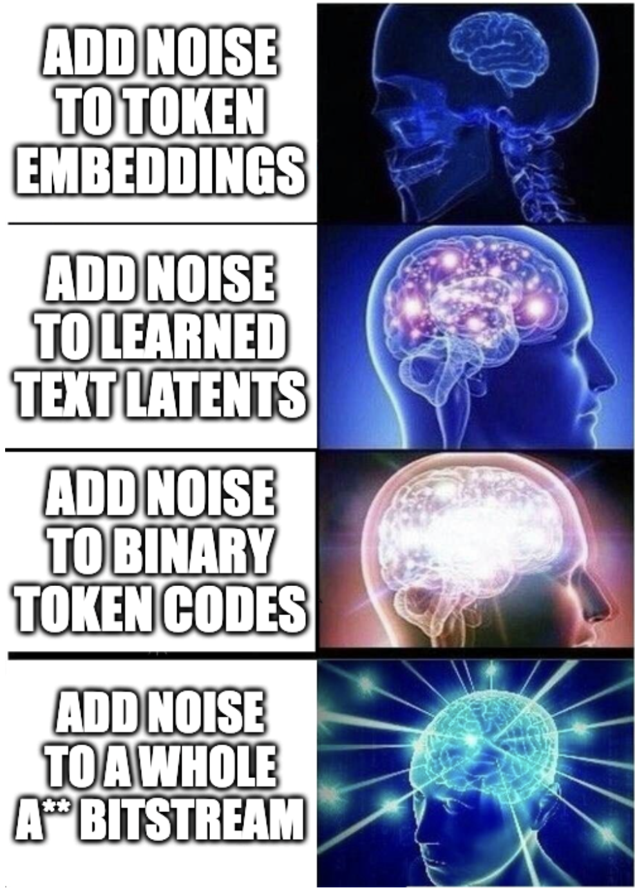

---

# Add Noise to Token Embeddings

**Flow Matching:** Learn a velocity field that pushes noisy representations towards valid text representations

  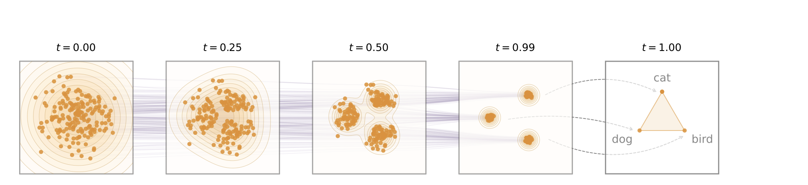

<Footnotes separator>
  <Footnote :number="1">Hu et al. (2026) — ELF: Embedded Language Flows</Footnote>
</Footnotes>

---

# Add Noise to Token Embeddings

  <h3 class="text-sm text-gray-500 mt-1">
  Training
  </h3>
  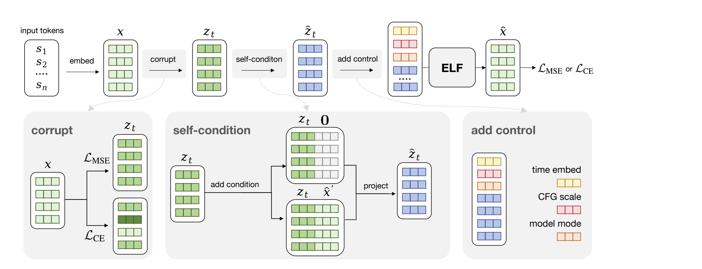

  <h3 class="text-sm text-gray-500 mt-1">
  Inference
  </h3>
  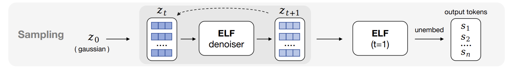

<Footnotes separator>
  <Footnote :number="1">Hu et al. (2026) — ELF: Embedded Language Flows</Footnote>
</Footnotes>

---

# Add Noise to Learned Text Latents
#### Components:
1. A text VAE (Variational Autoencoder)
2. A block causal diffusion Transformer

  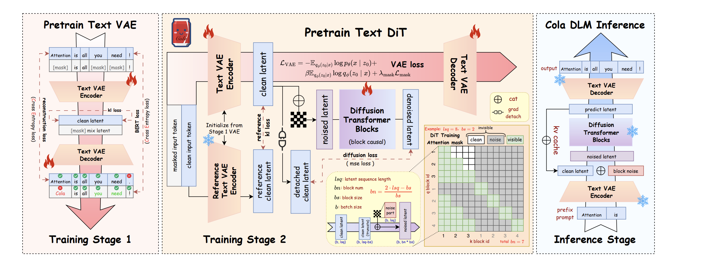

<Footnotes separator>
  <Footnote :number="1">Guo et al. (2026) — Continuous Latent Diffusion Language Model</Footnote>
</Footnotes>

---

# Add Noise to Binary Token Codes

For a vocabulary of size $V$, each token ID $y_i \in \{0, \dots, V - 1\}$ is mapped to a $B$-bit binary code, where $B$ is the binary code length.

  

    
  $$
  \phi(y_i) = 2 \cdot \text{bin}_B(y_i) - 1 \in \{-1, 1\}^B
  $$

  

  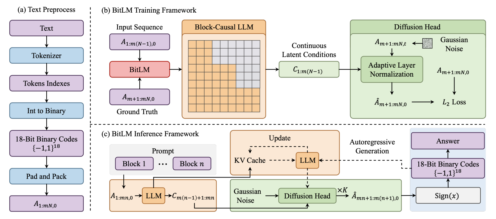

<Footnotes separator>
  <Footnote :number="1">Zhuang et al. (2026) — BitLM: Unlocking Multi-Token Language Generation with Bitwise Continuous Diffusion</Footnote>
</Footnotes>

---

# Add Noise to A Whole A** Bitstream

  

    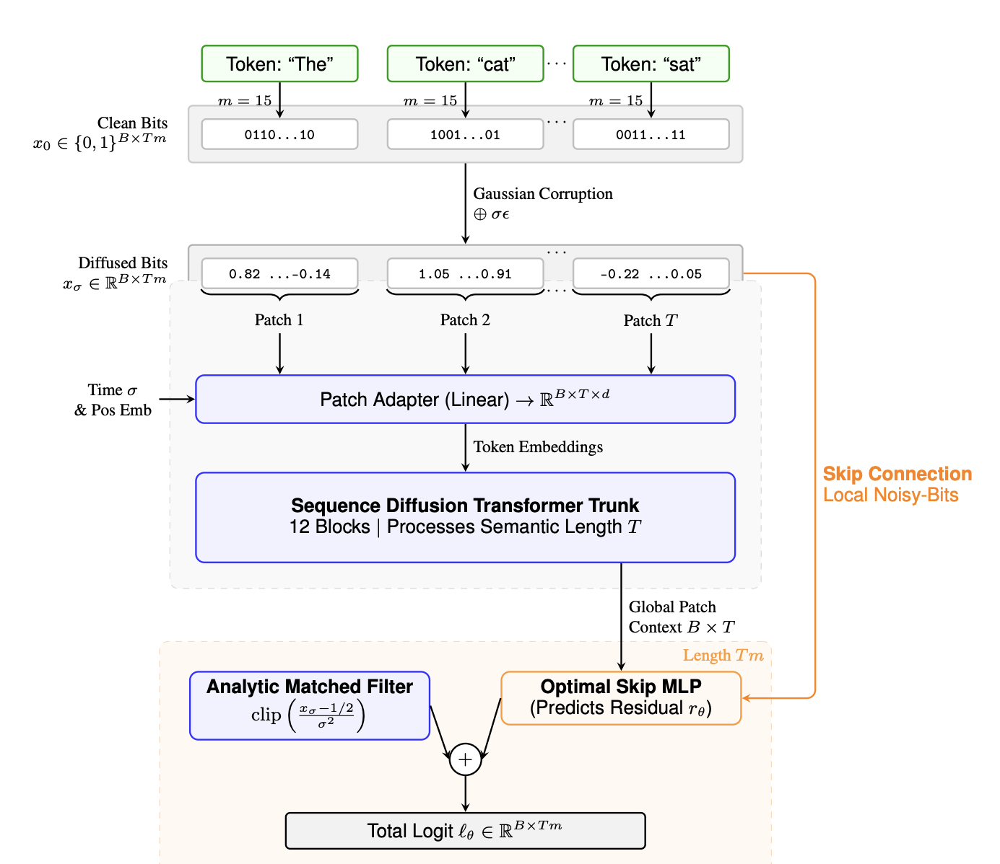
  

  

    <strong>Standard LLM:</strong>

$$\text{Logits} = B \times T \times V$$

<strong>CoBit:</strong>

$$\text{Logits} = B \times T \times \lceil \log_2 V \rceil$$

Where $B$ is batch size, $T$ is output tokens, and $V$ is vocabulary size.
  

<Footnotes separator>
  <Footnote :number="1">Batzolis et al. (2026) — CoBit: Language Modeling with Bitstream Diffusion</Footnote>
</Footnotes>

---
class: text-sm
---

# The Continuous dLLM Landscape

| **Paper** | **Representation** | **Generation Style** |
|---|---|---|
| **Cola DLM** | Learned semantic latents | Block-causal latent diffusion |
| **RePlaid** | Learned continuous token embeddings | Continuous token-aligned diffusion |
| **BitLM** | Fixed binary token IDs | Causal backbone + blockwise bit diffusion |
| **ELF** | Continuous token embeddings | Flow matching until final token decoding |
| **LDLM** | Jointly learned diffusion-friendly latents | Latent diffusion |
| **TextLDM** | TextVAE latents aligned to a frozen LM | Latent DiT + flow matching |
| **Entropy-gated Bitstream Diffusion** | Whole-sequence binary bitstreams | Parallel bitstream diffusion |

---

# Key Observations From Continuous dLLMs

- The right representation matters more than denoising
- Reconstruction quality is not a good proxy for generation quality
- Perplexity is not a good proxy for generation quality in continuous diffusion models

---

# Future Direction: Latent Space Engineering

  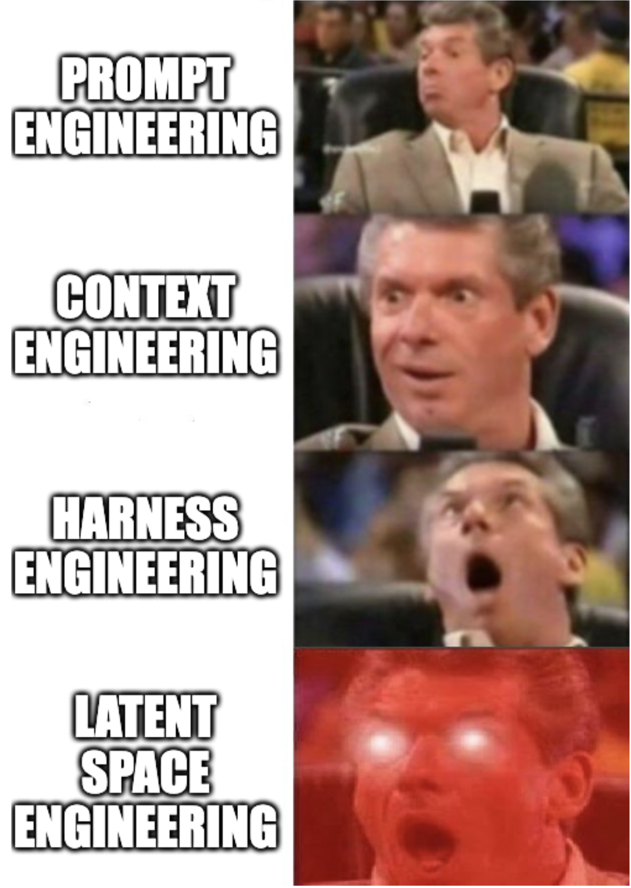

---

# Future Direction: Native Multi-Modality

Can all be represented in the same latent space

  

    

      Text
    

    

      Image
    

    

      Speech
    

    

      Video
    

  

  

    ...
  

---

# 6 Months Ago

  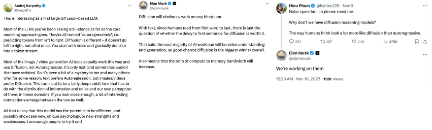

# 6 Months Later

  

    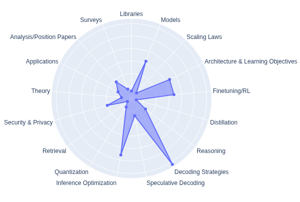
  

  

    
  

  

    
  

  

    
  

---

# Conclusion

>dLLMs are pretty cracked, however

| Use dLLMs when… | Stick with ARMs when… |
|---|---|
| Data is the bottleneck, not compute | Latency-sensitive streaming |
| Infilling / structured editing is core | Purely left-to-right generation |
| Non-linear reasoning benefits from revision | Serving efficiency at scale |

**Some Ideas:** hybrid systems — diffusion for planning and reasoning, autoregressive for final output generation

**Other promising futures:** unlocking latent space engineering and true multi-modality

---
layout: center
---

# Thank You

  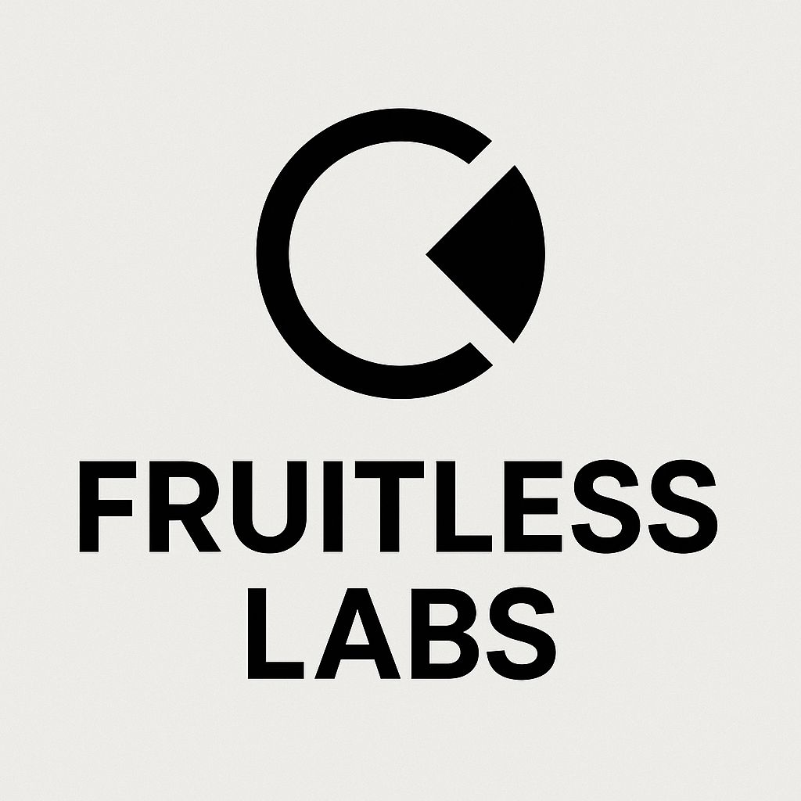

  iclr-blogposts.github.io/2026/blog/2026/dllm/
   
  github.com/piesauce/awesome-dLLM-resources

